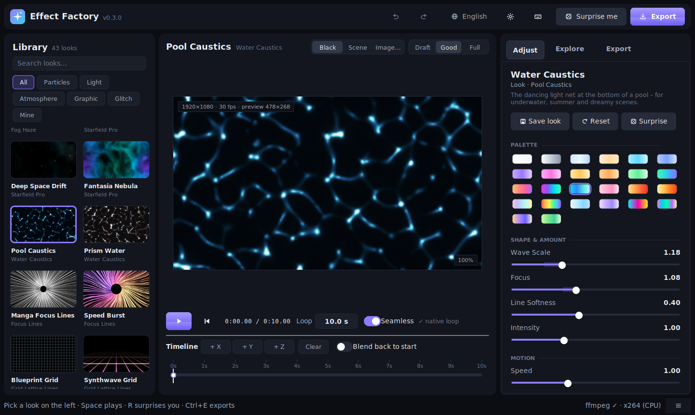
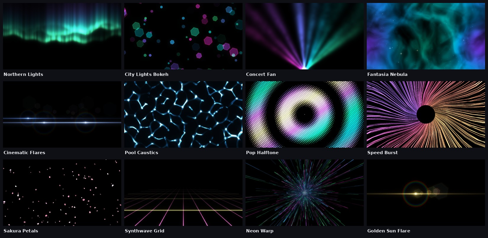
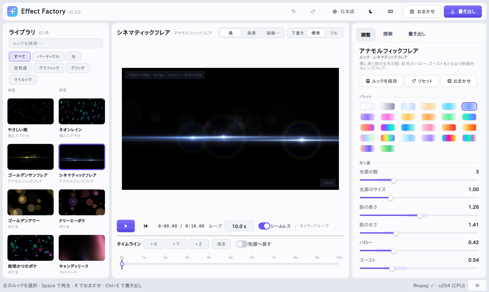

# EffectFactory

EffectFactory is a local-first desktop tool for making loopable overlay effects
for music videos, streams, shorts and other creator work. Pick a look, tweak it
live, export a seamless loop. Everything renders on your machine.

日本語 UI に対応しています（OS の言語設定に合わせて自動で切り替わり、ヘッダーからいつでも変更できます）。



## Highlights

- **Beautiful by default** – 17 procedural effects built on an HDR rendering
  kit (soft bloom, highlight roll-off, anti-aliasing, banding-free dithering)
  and 43 curated looks such as *Northern Lights*, *Cinematic Flares*,
  *Pool Caustics*, *Pop Halftone*, *Sakura Petals* and *Synthwave Grid*.
- **Japanese / English, dark / light** – the interface follows your system
  language and can be switched from the header (globe button), together with a
  dark or light theme (sun / moon button). Your work is kept when you switch.
- **Seamless loops** – motion is snapped to the loop length so most effects
  loop perfectly with no blending. Effects that cannot (and animated timelines)
  get an automatic cross-fade.
- **Easy to explore** – *Surprise me* makes tasteful random changes, the
  Explore tab renders six variations to pick from, and undo/redo covers every
  change.
- **Palettes everywhere** – 26 colour palettes shared by all effects, chosen
  from swatches.
- **See it in context** – preview over black, a built-in twilight scene or your
  own image (Screen blend), at draft/good/full quality.
- **Timeline variations** – store looks at X / Y / Z markers and the effect
  morphs between them; drag a marker right to hold it.
- **Pro exports** – MP4 (H.264, BT.709) with automatic hardware-encoder
  detection (NVENC / Quick Sync / AMF / VideoToolbox, falling back to x264),
  MOV with alpha (ProRes 4444), or transparent PNG sequences. Rendering runs on
  several threads, shows an ETA and can be cancelled.
- **Creator presets** – 1080p, 4K, 720p, vertical 9:16 and square 1:1 frames.
- **Reproducible** – every export writes a JSON file with the look, seed and
  resolved parameters.
- **Hackable** – effects are single Python files in `effects/`.





## Included effects

| Category   | Effects |
|------------|---------|
| Particles  | Sparkle Dust, Confetti Pro (paper, ribbons, hearts, petals, stars), Rain & Sprites (custom PNGs), Snowfall |
| Light      | Bokeh Orbs, Light Rays (stage / live), Light Leaks, **Anamorphic Flares** |
| Atmosphere | Fog Haze, Starfield Pro, Aurora Ribbons, **Water Caustics** |
| Graphic    | Focus Lines, Grid Lattice (incl. synthwave floor), Warp Speed, **Halftone Waves** |

New in 0.3:

- **Anamorphic Flares** – drifting lights with long horizontal lens streaks,
  spectral halo rings and ghost reflections mirrored through the frame centre.
- **Water Caustics** – the light net at the bottom of a pool, computed by
  refracting light through a moving wave surface (with optional prism-like
  dispersion and wind).
- **Halftone Waves** – pop-art dot screens whose dots swell with ripples,
  sweeps, interfering waves or noise, on a hexagonal or square grid.
| Glitch     | Glitch Scanlines |

## Requirements

- Python 3.10 or later with Tkinter (included with the python.org installers)
- `numpy` and `Pillow` (see `requirements.txt`)
- [ffmpeg](https://ffmpeg.org/download.html) for MP4/MOV export – found
  automatically on `PATH`, or locate it in the Export tab. PNG sequences work
  without ffmpeg.

## Setup

```powershell
py -3.11 -m venv .venv
.\.venv\Scripts\Activate.ps1
python -m pip install -r requirements.txt
python effect_factory.py
```

On macOS / Linux use `python3 -m venv .venv` and `source .venv/bin/activate`.

## Using Effect Factory

1. **Pick a look** in the library on the left (search or filter by category).
2. **Adjust** it on the right. Sliders show the look's random range as a faint
   band; edited values get a dot. Double-click a slider to reset it, click its
   number to type a value, Shift-drag for fine control.
3. **Explore**: press *Surprise me* (or `R`), or click one of the generated
   variations. `Ctrl+Z` undoes anything.
4. **Animate** (optional): save the current look to marker X/Y/Z at the
   playhead (`1`/`2`/`3`), change settings, save another marker. The effect
   blends between markers; drag a marker to the right to hold it.
5. **Export** from the Export tab (or `Ctrl+E`). Use *Draft MP4* for a quick
   half-resolution check, *Still PNG* for thumbnails, *ZIP package* to bundle a
   render with the README/LICENSE templates in `templates/`.

The globe button in the header switches the language (日本語 / English /
match the system) and the sun / moon button switches between the dark and light
themes; both are remembered.

Your own looks are saved with *Save look* (`Ctrl+S`) and appear under *Mine*.
They live in your user folder (`%APPDATA%\EffectFactory`, `~/Library/Application Support/EffectFactory`
or `~/.config/effect-factory`) together with your settings.

### Keyboard shortcuts

| Key | Action |
|-----|--------|
| `Space` | Play / pause |
| `Home`, `←` / `→` | Back to start, step one frame |
| `R` | Surprise me |
| `1` / `2` / `3` | Save marker X / Y / Z at the playhead |
| `Ctrl+Z` / `Ctrl+Y` | Undo / redo |
| `Ctrl+S` | Save as your look |
| `Ctrl+E` | Export |
| `Ctrl+F` | Search the library |
| `Ctrl+0` | Reset zoom (mouse wheel on the preview zooms) |
| `F1` | Show all shortcuts |

### Command line

```text
python effect_factory.py --look "Northern Lights" --tab export
python effect_factory.py --theme light --lang ja     # for this session only
python effect_factory.py --screenshot window.png   # capture the window and quit
```

## Output files

| File | Contents |
|------|----------|
| `*.mp4` | Black-background overlay (use Screen / Add / Lighten blend) |
| `*.mov` | ProRes 4444 with alpha derived from brightness (normal blend) |
| `<name>/frame_00001.png …` | Transparent PNG sequence |
| `*_thumb.png` | First frame |
| `*.json` | Look, seed, resolved parameters, timeline and render settings |
| `_preview/` | Draft renders |
| `_state.json` | Variation counter (when *New variation after each export* is on) |

Generated media is ignored by Git.

## How seamless loops work

Every effect receives the loop length. Frequencies are snapped to a whole
number of cycles per loop, particles respawn on lifetimes that divide the loop,
and textures scroll with a three-phase "flow" blend whose weights are periodic.
The result is that frame *N* equals frame *0* exactly. Effects that are not
periodic by design (and clips animated with timeline markers) are closed with a
short cross-fade, shown as *loop blend* on the timeline.

## Project layout

```text
effect_factory.py   launcher (CLI options, Windows console/DPI handling)
efx/core.py         plugins, looks, parameter resolution, timeline model
efx/engine.py       frame renderer, loop cross-fades, camera zoom
efx/export.py       ffmpeg discovery, encoders, MP4/MOV/PNG export
efx/randomize.py    Surprise me and variations
efx/settings.py     user settings and saved looks
efx/i18n.py         UI translations (English source strings, Japanese)
efx/ui/             Tk interface (themes, widgets, library, preview, inspector)
effects/            effect plugins and the shared rendering kit (_fxkit.py)
presets/            built-in looks (JSON)
tests/              unit, render, export and UI smoke tests
```

## Writing an effect plugin

Each plugin is a Python file in `effects/` with an `EFFECT` dictionary:

```python
EFFECT = {
    "id": "my_effect",
    "name": "My Effect",
    "category": "Particles",
    "description": "One sentence for the library.",
    "seamless": True,
    "params": [
        {"key": "count", "label": "Amount", "type": "int", "default": 200,
         "min": 10, "max": 1000, "group": "shape"},
        {"key": "palette", "label": "Palette", "type": "palette", "default": "aurora", "group": "color"},
    ],
    "i18n": {"ja": {"name": "マイエフェクト", "params": {"count": ("量", "粒の数。")}}},  # optional
    "build_cache": build_cache,
    "render_frame": render_frame,
}
```

See [docs/PLUGIN_API.md](docs/PLUGIN_API.md) for the full contract and the
helpers in `effects/_fxkit.py` (palettes, loop-safe particles, bloom…).
`effects/sparkle_dust.py` is a compact example.

## Development

```bash
python -m pip install -r requirements.txt
python -m unittest discover -s tests -v
```

The UI smoke test is skipped when no display is available (use `xvfb-run` on
headless Linux). See [CONTRIBUTING.md](CONTRIBUTING.md).

## License

MIT License. See `LICENSE`.
